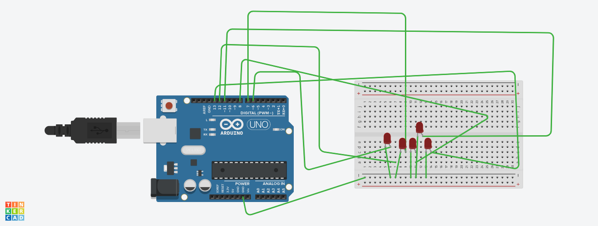

# embedded-system-development with Arduino

#### This project demonstrates an embedded system developed using Arduino and C++ to create a seamless integration between software and hardware components. The system is designed to simulate a fantabulous elzing simulator, which links software code with physical hardware, showcasing the power and flexibility of embedded systems.

## Key Features:

#### C++ based programming for efficient control and logic.
#### Arduino integration to manage hardware components like sensors, actuators, and displays.
#### Elzing simulator for real-time interaction between the code and hardware, mimicking real-world behaviors.
#### Modular and scalable code architecture, ideal for developing more complex embedded systems.
#### This project highlights the potential of combining embedded programming with Arduino to create robust, interactive systems for educational or practical applications.

#### Here is an arrangement in which 5 LED bulbs blink continuously with a time delay. This is built by manipulating the hardware components and applying the software code to the arduino.

#### This description explains the core aspects of your project, focusing on the key technical components and the unique simulation aspect.